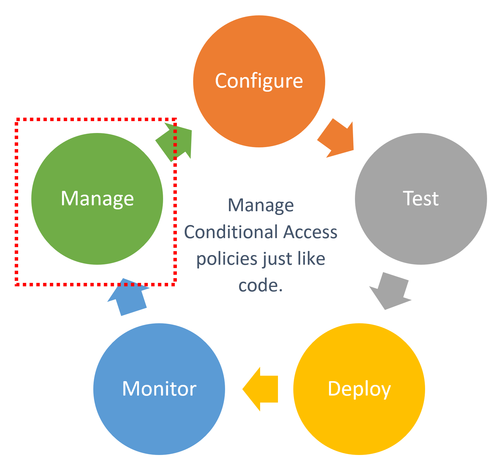
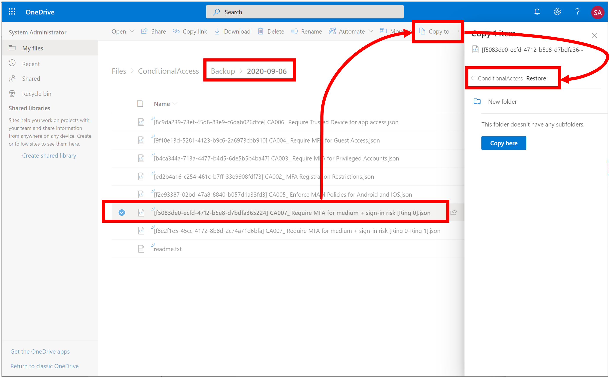
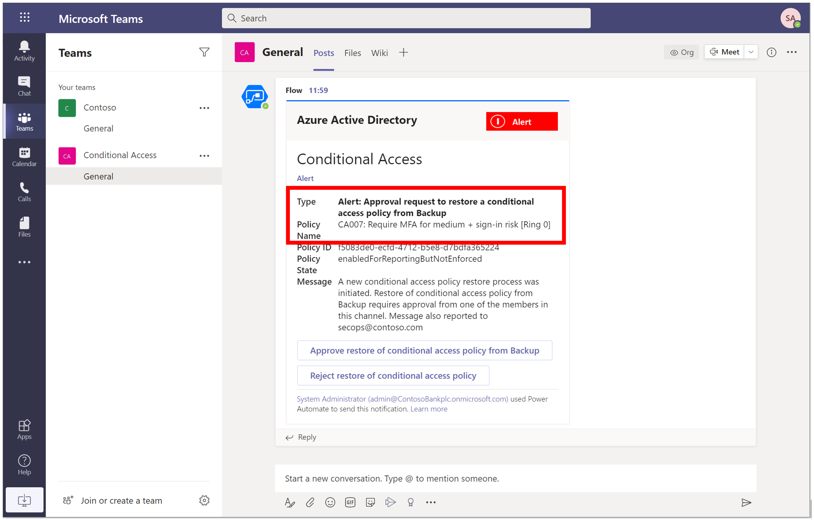
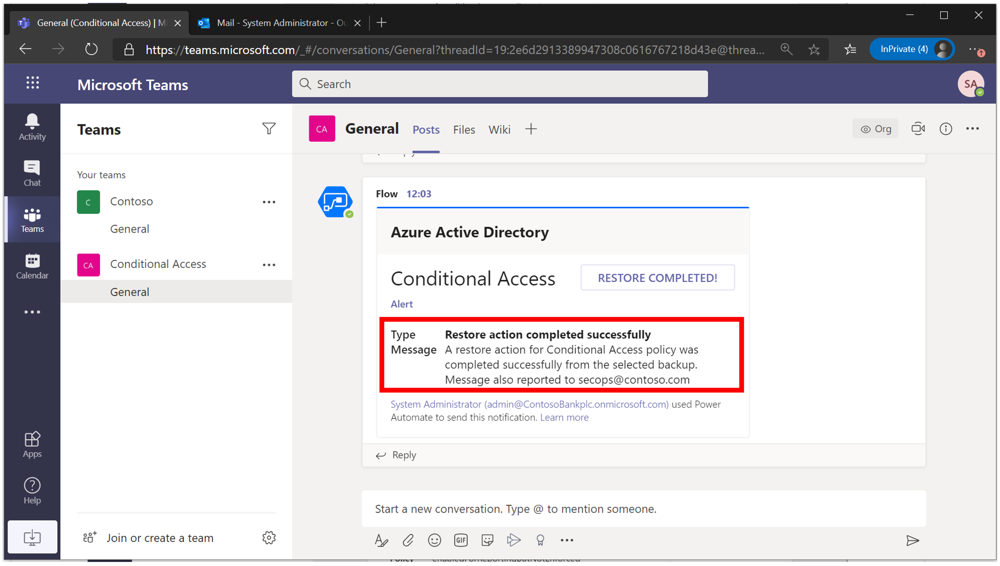
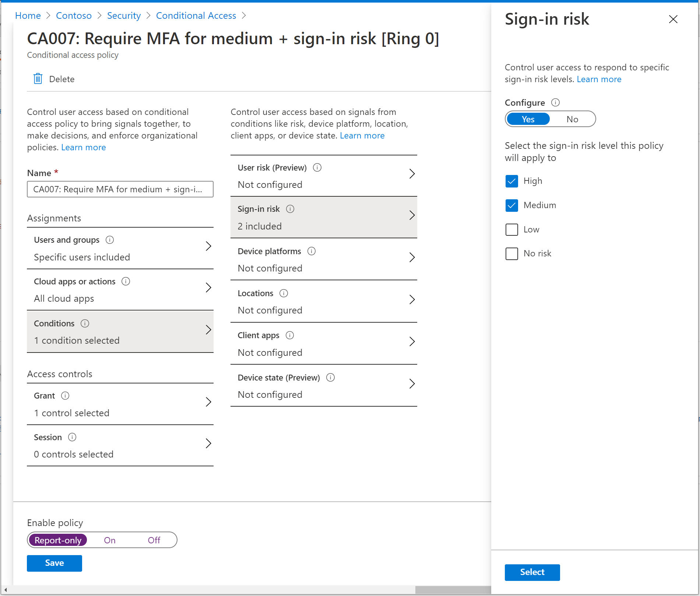
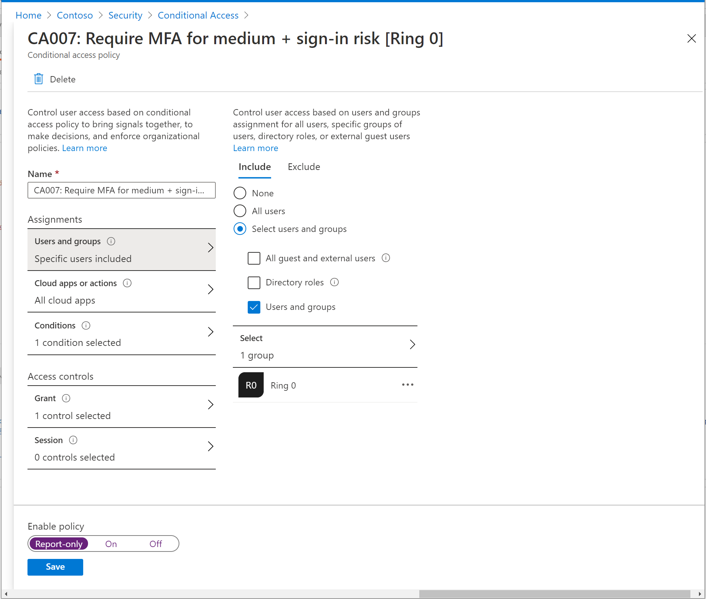
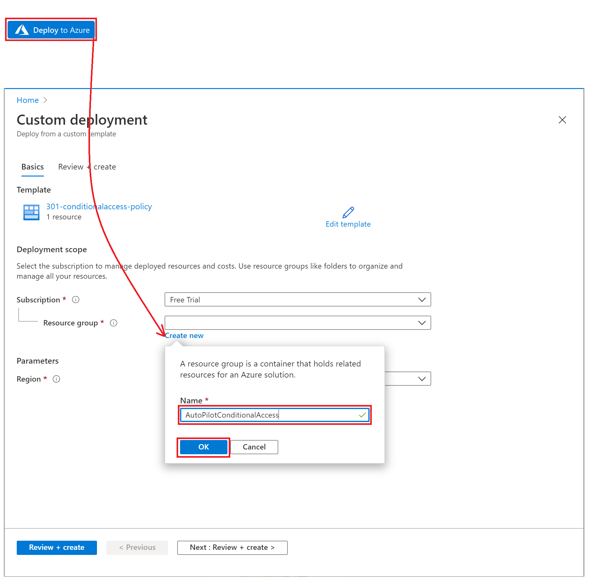
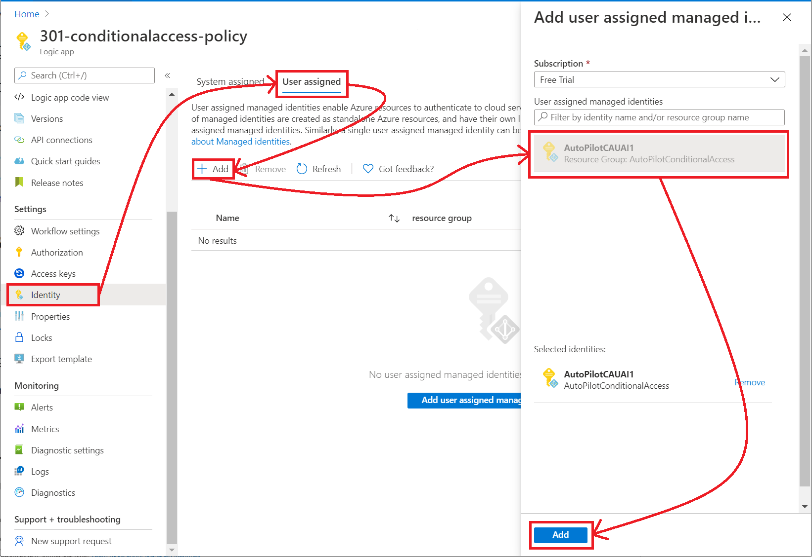
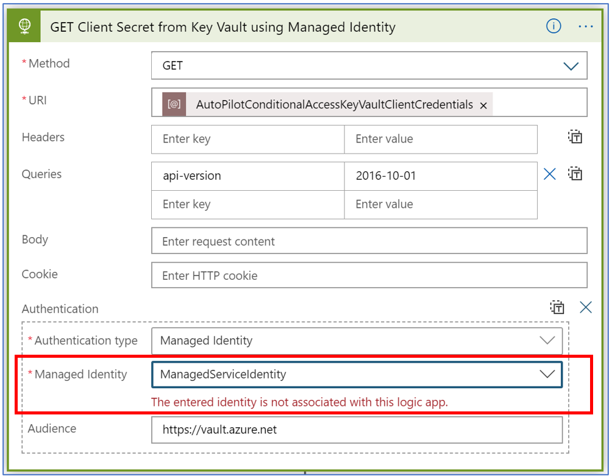

# Tutorial: Backup and Restore Conditional Access policies with approval workflow

Intent: As an IT admin, I want to be able to easily backup-restore conditional access policies.

You can use the conditional access APIs to easily backup conditional access policies. For example, you can:

As a IT admin, be able to automate a regular backup/snapshot of all conditional access policies within your environment. Select a policy to Restore. Finally, restore the conditional access policy in your production environment.

   

This automation can be very useful for:

- Organizations that manages large numbers of conditional access policies.
- Identity partners that manages policies for customers.

This tutorial shows how to build a [logic app](https://docs.microsoft.com/azure/logic-apps/) that allows backup-restore of conditional access policies. Specifically, this logic app takes a snapshot of all conditional access policies as a scheduled task within OneDrive. Another logic app monitors any policies being queued in the Restore folder of Ondrive. If a new policy is detected, an approval workflow is triggered on Team channel. On approval, the policy is restored to production environment.

In this tutorial, you learn how to:

:heavy_check_mark: Deploy this logic app to your organization.

:heavy_check_mark: Authenticate your logic app to Azure AD with the right permissions.

:heavy_check_mark: Add parameters and connections specific to your organization within logic app.

When you're done, you will be able to backup-restore Conditional Access policies in your production environment:

1. Select the policy you want to restore from Backup and copy to Restore OneDrive folder.

   

1. Approve Restore action in Teams

   

1. Receive notification that Restore action is successfully completed in your production environment

   

1. View your restored Conditional Access policy in Azure portal

   

1. Check your user assignments are correct within the policy

   

## Pre-requisites

If you don't have an Azure subscription, create a [free Azure account](https://azure.microsoft.com/free/?WT.mc_id=A261C142F) before you start.

You will also need knowledge of key concepts within Azure logic apps, OneDrive and Teams.

## Step 1: Deploy this logic app to your organization

If your Azure environment meets the prerequisites, and you're familiar with using ARM templates, these steps help you sign in directly to Azure and open the ARM template in the Azure portal. For more information, see [Deploy resources with ARM templates and Azure portal](https://docs.microsoft.com/azure/azure-resource-manager/templates/overview).

Select the following image to sign in with your Azure account and open the logic app in the Azure portal:

## Logic App for Backup

   

   [Video Link that takes you through the deployment process for Backup of conditional access policies](https://www.screencast.com/t/c8VXNe7FhANS)

## Logic App for Restore
  
   

   [Video Link that takes you through the deployment process for Restore of conditional access policies](https://www.screencast.com/t/fmUlaf3mW)
  
1. In the portal, on the **Custom deployment** page, enter or select these values:

   | Property | Value | Description |
   |----------|-------|-------------|
   | **Subscription** | <*Azure-subscription-name*> | The name for the Azure subscription to use |
   | **Resource group** | <*Azure-resource-group-name*> | The name for a new or existing Azure resource group. This example uses `AutoPilotConditionalAccess`. |
   | **Location** |  <*Azure-region-for-all-resources*> | The Azure region to use for all resources, if different from the default value. This example uses the default value, `[resourceGroup().location]`, which is the resource group location. |
   | **Logic App Name** | <*logic-app-name*> | The name to use for your logic app. This example uses `301-conditionalaccess-policy-backup-automation` and `301-conditionalaccess-policy-restore-automation`. |

   Here is how the page looks with the values used in this example:

   

1. When you're done, select **Review + Create** and finally **Create**.

## Step 2: Authenticate your logic app to Azure AD with the right permissions

This logic app uses managed identity for getting secrets from key vault in order to call conditional access APIs. Please look at [Authenticate your logic app to Azure AD with the right permissions](https://github.com/videor/AutoPilotConditionalAccess/tree/master/AutoPilotConditionalAccess/azure-quickstart-templates/docs) on how to create key vault and connect to managed identity. To learn more on how to use managed identities within Logic App please look at [**Logic Apps and Managed Identities**](https://docs.microsoft.com/azure/logic-apps/create-managed-service-identity) .

1. In the left-hand navigation pane, select Identity > User Assigned > Select Add.

2. Select the User-assigned managed identity from the context pane that appears on the right, select Add.

   

## Step 3: Update parameters

1. In the left-hand navigation pane, select Logic App designer > Parameters > Replace the default value with Key Vault URI (storing Client Secret), Client ID and Tenant ID.

   

## Step 4: Select appropriate managed identity

1. On the Logic App Designer, in the HTTP connection box, click `GET client secret from key vault using managed identity`. This example uses HTTP connector.

1. Specify the Managed Identity to use.

   

## Step 5: Connect to your OneDrive account and select the Backup and Restore folders in respective logic apps you will like to use for automation

1. On the Logic App Designer, in the OneDrive for Business connection box, click `Connections`. This example uses OneDrive connector for Logic apps:

   

1. If prompted, sign in to your email account with your credentials so that Logic Apps can create a connection to your OneDrive account.

1. If connection is successful, select the OneDrive folder you would like to use for automation.

## Step 6: Connect to Teams channel for approving or rejecting Restore requests

1. On the Logic App Designer, in the Teams connection box, click `Connections`. This example uses Teams connector:

   

1. If prompted, sign in to your email account with your credentials so that Logic Apps can create a connection to your Teams account.

1. Specify the Team and channel you will like to use for automation of approval workflow.

## Step 7: Update all other connectors within Logic App

Similar to above, update remaining OneDrive and Teams connectors within the sample Logic App by selecting appropriate OneDrive and Teams account that needs to be used for automation.

> [!WARNING]
> Please ensure you follow the best practice guidelines on managing secrets within Logic apps by using secure inputs and outputs as [documented here](https://docs.microsoft.com/azure/logic-apps/logic-apps-securing-a-logic-app).

## Next steps

Try the following challenge:

:heavy_check_mark: Edit this logic app to send a custom message on Teams channel when the approval workflow selection is Reject restore action.

If you would like to request a logic app to do this, please send a request on Twitter @Vi_Deora.
